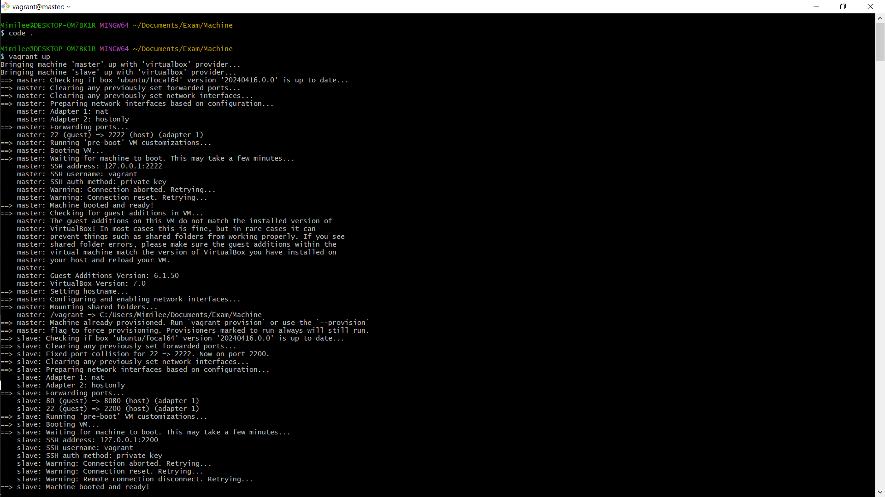
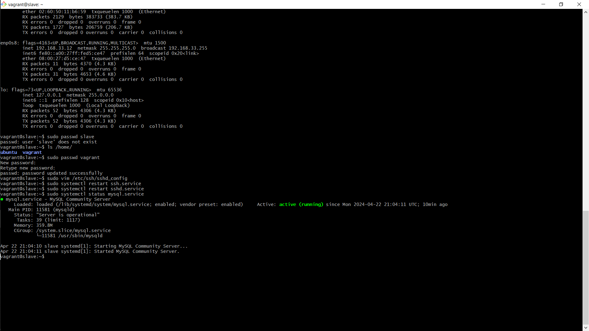
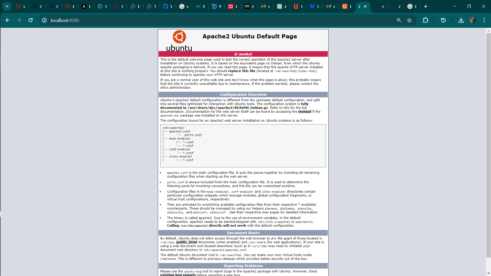

# Second Semester Exam

## (Deploy LAMP Stack)

## `Objective:`

- Automate the provisioning of two Ubuntu-based servers, named “Master” and “Slave”, using Vagrant.
- On the Master node, create a bash script to automate the deployment of a LAMP (Linux, Apache, MySQL, PHP) stack.
- This script should clone a PHP application from GitHub, install all necessary packages, and configure Apache web server and MySQL.
- Ensure the bash script is reusable and readable.

`Using an Ansible playbook:`

- Execute the bash script on the Slave node and verify that the PHP application is accessible through the VM’s IP address (take screenshot of this as evidence)
- Create a cron job to check the server’s uptime every 12 am.

## Overview Of Task Execution

- In this Document i'll outline the steps required to deploy a PHP Laravel application using Ansible and Bash Script ensuring Accessibility.

- Ansible Communicates with slave node using SSH connection

## Tasks:

### - Bash Script:

1. Write Bash script to provision slave node with all neccessary dependencies required to deploy a Php Laravel Application (Installing LAMP stack)

2. Install Composer: Composer is used to setup PHP project by installing the neccessary depending required to run app

3. Cloning official Laravel Github Repo

4. Setup MySql Server (Create User and Database)

5. Setup Apache Virtual Host

`latest.sh`

```

#!/bin/bash
#update your linux system
sudo apt update -y
#install your apache webserver
sudo apt install apache2 -y
#add the php ondrej repository
sudo add-apt-repository ppa:ondrej/php --yes
#update your repository again
sudo apt update -y
# install php8.2
sudo apt install php8.2 -y
#install some of those php dependencies that are needed for laravel to work
sudo apt install php8.2-curl php8.2-dom php8.2-mbstring php8.2-xml php8.2-mysql zip unzip -y
#enable rewrite
sudo a2enmod rewrite
#restart your apache server
sudo systemctl restart apache2
#change directory in the bin directory
cd /usr/bin
install composer globally -y
sudo curl -sS https://getcomposer.org/installer | sudo php -q
#move the content of the deafault composer.phar
sudo mv composer.phar composer
#change directory in /var/www directory so we can clone of laravel repo there
cd /var/www/
sudo git clone https://github.com/laravel/laravel.git
sudo chown -R $USER:$USER /var/www/laravel
cd laravel/
install composer autoloader
composer install --optimize-autoloader --no-dev --no-interaction
composer update --no-interaction
#copy the content of the default env file to .env 
sudo cp .env.example .env
sudo chown -R www-data storage
sudo chown -R www-data bootstrap/cache
cd
cd /etc/apache2/sites-available/
sudo touch latest.conf
sudo echo '<VirtualHost *:80>
    ServerName localhost
    DocumentRoot /var/www/laravel/public

    <Directory /var/www/laravel>
        AllowOverride All
    </Directory>

    ErrorLog ${APACHE_LOG_DIR}/laravel-error.log
    CustomLog ${APACHE_LOG_DIR}/laravel-access.log combined
</VirtualHost>' | sudo tee /etc/apache2/sites-available/latest.conf
sudo a2ensite latest.conf
sudo a2dissite 000-default.conf
sudo systemctl restart apache2
cd
sudo apt install mysql-server -y
sudo apt install mysql-client -y
sudo systemctl start mysql
sudo mysql -uroot -e "CREATE DATABASE mimilee;"
sudo mysql -uroot -e "CREATE USER 'peace'@'localhost' IDENTIFIED BY 'ogechi';"
sudo mysql -uroot -e "GRANT ALL PRIVILEGES ON mimilee.* TO 'peace'@'localhost';"
cd /var/www/laravel
sudo sed -i "23 s/^#//g" /var/www/laravel/.env
sudo sed -i "24 s/^#//g" /var/www/laravel/.env
sudo sed -i "25 s/^#//g" /var/www/laravel/.env
sudo sed -i "26 s/^#//g" /var/www/laravel/.env
sudo sed -i "27 s/^#//g" /var/www/laravel/.env
sudo sed -i '22 s/=sqlite/=mysql/' /var/www/laravel/.env
sudo sed -i '23 s/=127.0.0.1/=localhost/' /var/www/laravel/.env
sudo sed -i '24 s/=3306/=3306/' /var/www/laravel/.env
sudo sed -i '25 s/=laravel/=mimilee/' /var/www/laravel/.env
sudo sed -i '26 s/=root/=peace/' /var/www/laravel/.env
sudo sed -i '27 s/=/=ogechi/' /var/www/laravel/.env
sudo php artisan key:generate
sudo php artisan storage:link
sudo php artisan migrate
sudo php artisan db:seed
sudo systemctl restart apache2

```

### - Ansible playbook

1. Copy script to slave node `laravel_app.sh`

2. Setup Cron to Check Server Up-Time Every 12AM

3. Check PHP Application Accessibility

`bootstrap_slave.yml`

```
---
- name: Execute Bash Script on Slave Node
  hosts: slave
  tasks:
    - name: Run the bash script
      script: setup-slave.sh

```


## Master Node



## >> Slave >>




## Live View of Laravel App

